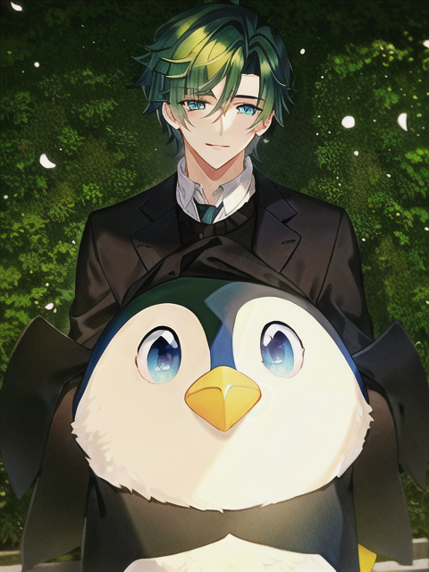
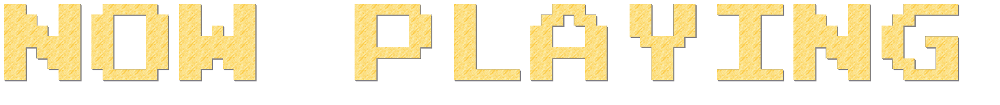

<!--cat-->
<div id="header" align="center">
  
</div>

<!--badges-->
<div id="badges" align="center">
  <a href="https://www.linkedin.com/in/leonardo-ara%C3%BAjo-freitas-734732228/">
    
  </a>
  <a href="https://www.instagram.com/da.vinki2510">
    
  </a>
   <a href="https://open.spotify.com/user/melwwt1dl1y0m19x8k1c44eim?si=21e5df35ce034206&nd=1">
    
  </a>
  <a (mailto:"leonardo1924@protonmail.com)
    
  </a>
   <a href="Walker19#0010">
    
  </a>
</div>

<!--counter-->
<div id="counter" align="center">

</div>

<!--intro-->
<div id = "intro "align="center">
<h2> Hello There! I'm Leo!

</h2>
</div>

<!--line-->
<div id="line">

</div>

<div align="center">
  
  
```diff
+@ @ @ @ @ @ @ @ @ @ @ @ @ @ @ @ @ @ @ @ @ @ @ @ @ @ @ @+
@@       o o                                           @@
@@       | |                                           @@
@@      _L_L_                                          @@
@@   ❮\/__-__\/❯ Programming isn't about what you know @@
@@   ❮(|~o.o~|)❯  It's about what you can figure out   @@
@@   ❮/ \`-'/ \❯                                       @@
@@     _/`U'\_                                         @@
@@    ( .   . )     .----------------------------.     @@
@@   / /     \ \    | while( ! (succed=try() ) ) |     @@
@@   \ |  ,  | /    '----------------------------'     @@
@@    \|=====|/                                        @@
@@     |_.^._|                                         @@
@@     | |"| |                                         @@
@@     ( ) ( )   Testing leads to failure              @@
@@     |_| |_|   and failure leads to understanding    @@
@@ _.-' _j L_ '-._                                     @@
@@(___.'     '.___)                                    @@
+@ @ @ @ @ @ @ @ @ @ @ @ @ @ @ @ @ @ @ @ @ @ @ @ @ @ @ @+
```
  
</div>

<!--line-->
<div id="line">

</div>

<!--ABOUT-->
<div id="about" align="center">

<h2> ABOUT ME </h2>
<h4> I’m currently studying Software Engineering at </h4>

<div id="Uni" align="center">
<b>University of Minho.</b>
</div>
<h4> I’m working as a Junior System Administrator at </h4> 

<div id="Work" align="center">
<b> Eurotux Informática,Sa.</b>
<h3></h3>
</div>
  
[](https://git.io/streak-stats)

</div>

<!--line-->
<div id="line">

</div>

<!--tools-->
<div id="skills" align="center">
  <h3> :hammer_and_wrench: Languages and Tools </h3>                                                                          
  &nbsp;
  &nbsp;
  &nbsp;
  &nbsp;
  &nbsp;
  &nbsp;
  &nbsp;
  &nbsp;
  &nbsp;
  <h3></h3>
</div>

<!--line-->
<div id="line">

</div>

<div id="spotify" align="center">

  
[](https://open.spotify.com/user/melwwt1dl1y0m19x8k1c44eim)
</div>

<!--🦶FOOTER--> 


