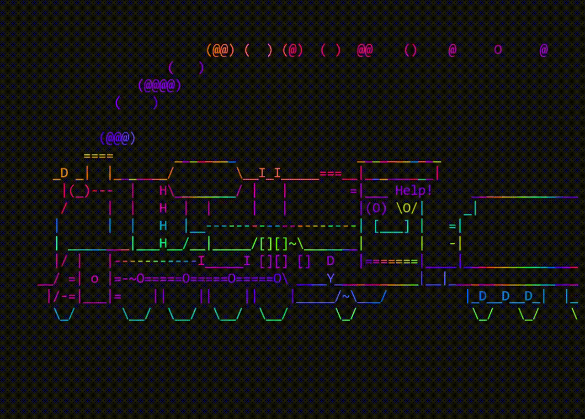

<!--cat-->

  

<!--badges-->

  
  
   
  
   

<!--intro-->

<h2> Hello There! I'm Leo!

</h2>

<!--ABOUT-->

<h2> ABOUT ME </h2>
<h4> I studied Software Engineering at </h4>

<b>University of Minho.</b>
<h4> Finished in 2024 with an average grade of 13 </h4>
<h4> My Current OS is </h4>
&nbsp;<!--Done-->

  

<!--line-->

<!--tools-->

  <h3> 
    :hammer_and_wrench: Languages and Tools 
  </h3>

  

  &nbsp;<!--Done-->
  &nbsp;<!--Done-->
  &nbsp;<!--Done-->
  &nbsp;<!--Done-->
  &nbsp;<!--Done-->
  &nbsp; <!--Done-->
  &nbsp;<!--Done-->
  &nbsp;<!--Done-->
  &nbsp;<!--Done-->
  &nbsp;<!--Done-->
  &nbsp;<!--Done-->
  &nbsp;
  <h3></h3>

<!--line-->

  

  

